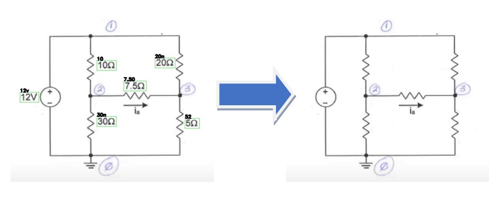

# Image-to-Netlist Conversion Pipeline

This repository contains the implementation of an Image-to-Netlist Conversion pipeline. The tool extracts circuit layouts from image representations and generates a corresponding netlist. This is a proof of concept that can be improved and implemented in circuit analysis softwares. I can be beneficial for students and professionals in electronics and hardware design domains.

## Table of Contents

- [Introduction](#introduction)
- [Features](#features)
- [Installation](#installation)
- [Acknowledgements](#acknowledgements)

## Introduction

As PCB designs and circuit layouts become increasingly intricate, it becomes essential to have tools that can aid in design and verification. The Image-to-Netlist Conversion pipeline takes an image of a circuit layout and translates it into a functional netlist, helping streamline the design process and reverse-engineer existing designs.

## Features

### 1. **Image Pre-processing**: 
- **Remove the values to increase the clarity of input images for better conversion**.

3. **Component Detection**: Detects components like resistors, inductors, current sources, and voltage sources.
4. **Routing Extraction**: Extracts routing information and connections between components.
5. **Netlist Generation**: Outputs a SPICE-compatible netlist for simulations.

## Installation

For a detailed installation guide, please refer to [this repository](https://github.com/nicknochnack/TFODCourse) or [watch our installation tutorial on YouTube](https://www.youtube.com/watch?v=yqkISICHH-U&t=1823s).

## Acknowledgments

- **[Nicholas Renotte](https://github.com/nicknochnack)**: For his invaluable insights on training and setting up custom object detection model.
- **[OpenCV](https://opencv.org/)**: For image processing tasks.
- **[TensorFlow](https://www.tensorflow.org/)**: For providing the deep learning framework used in various components of this project.
- **[EasyOCR](https://github.com/JaidedAI/EasyOCR)**: For optical character recognition capabilities employed in this project.
- **Network Analysis and Synthesis**: *Circuits Illustrated*, authored by M.E. Van Valkenburg. This book was a pivotal resource for sourcing circuit images used in training the model. I express my sincere gratitude for the comprehensive compilation of circuit diagrams and the contribution it has made to my research.

