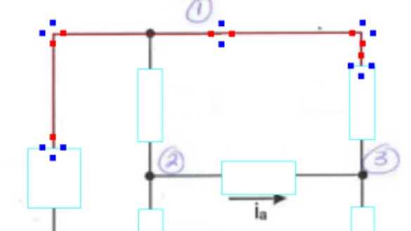
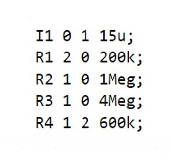

# Image-to-Netlist Conversion Pipeline

This repository contains the implementation of an Image-to-Netlist Conversion pipeline. The tool extracts circuit layouts from image representations and generates a corresponding netlist. This is a proof of concept that can be improved and implemented in circuit analysis softwares. It can be beneficial for students and professionals in electronics and hardware design domains.

## Table of Contents

- [Introduction](#introduction)
- [Features](#features)
- [Installation](#installation)
- [Acknowledgements](#acknowledgements)

## Introduction

As PCB designs and circuit layouts become increasingly intricate, it becomes essential to have tools that can aid in design and verification. The Image-to-Netlist Conversion pipeline takes an image of a circuit layout and translates it into a functional netlist, helping streamline the design process and reverse-engineer existing designs.

## Features

### 1. **Image Pre-processing**: 
- **Remove the values to increase the clarity of input images for better conversion**.

### 2. **Component Detection**: 
- **Detects components like resistors, inductors, current sources, and voltage sources**.

### 3. **Routing Extraction**: 
- **Extracts routing information and connections between components**.
<table>
<tr>
<th align="center">Feature: Device Orientation</th>
</tr>
<tr>
<td valign="middle" width="80%">

- **Path Checking**: Using the midpoints of the bounding box, the function checks connectivity paths both vertically and horizontally in the image using the check_path function.
- **Orientation Decision**: Based on the results from path checks and certain assumptions, the function determines if the device is vertically or horizontally oriented.

</td>
<td valign="top" width="20%">

</td>
</tr>
<tr>
<th align="center">Feature: Blocked Directions</th>
</tr>
<tr>
<td valign="middle" width="80%">

- **Region Extraction**: Using given x and y check points, the function extracts small regions around these points in all four directions: left, right, up, and down.
- **RGB Averaging**: It calculates the average RGB values for each of the extracted regions to determine their color characteristics.
- **Path Blockage Check**: For each direction, the function checks if the average color values exceed a threshold (200 for each channel in this case) to decide whether that direction is blocked or not.

</td>
<td valign="top" width="20%">

</td>
</tr>
<tr>
<th align="center">Feature: Correct Path</th>
</tr>
<tr>
<td valign="middle" width="80%">

- **Find the Correct Path**: The function finds the row with the smallest average RGB values and adjusts the check_pt accordingly, either directly or based on the most frequent row with the smallest value.

</td>
<td valign="top" width="20%">

</td>
</tr>
<tr>
<th align="center">Feature: Find Nodes</th>
</tr>
<tr>
<td valign="middle" width="80%">

- **Traverse through all path**: The loop starts with each device and continues as long as the pixel color is either black (shade of black) or red. If a different color pixel is encountered, the loop breaks.
- **Find all the nodes**: For each pixel check if the certain coordinate is in the node_list, if so add it to the node_device array with corresponding coordinate and the device.

</td>
<td valign="top" width="20%">

</td>
</tr>
</table>

### 4. **Netlist Generation**: 
- **Outputs a SPICE-compatible netlist for simulations**.
<table>
<tr>
<td align="center" valign="middle" width="50%">
    
</td>
<td align="center" valign="middle" width="50%">
    
</td>
</tr>
</table>

## Installation

For a detailed installation guide, please refer to [this repository](https://github.com/nicknochnack/TFODCourse) or [watch our installation tutorial on YouTube](https://www.youtube.com/watch?v=yqkISICHH-U&t=1823s).

## Acknowledgements

- **[Nicholas Renotte](https://github.com/nicknochnack)**: For his invaluable insights on training and setting up custom object detection model.
- **[OpenCV](https://opencv.org/)**: For image processing tasks.
- **[TensorFlow](https://www.tensorflow.org/)**: For providing the deep learning framework used in various components of this project.
- **[EasyOCR](https://github.com/JaidedAI/EasyOCR)**: For optical character recognition capabilities employed in this project.
- **Network Analysis and Synthesis**: *Circuits Illustrated*, authored by M.E. Van Valkenburg. This book was a pivotal resource for sourcing circuit images used in training the model. I express my sincere gratitude for the comprehensive compilation of circuit diagrams and the contribution it has made to my research.

